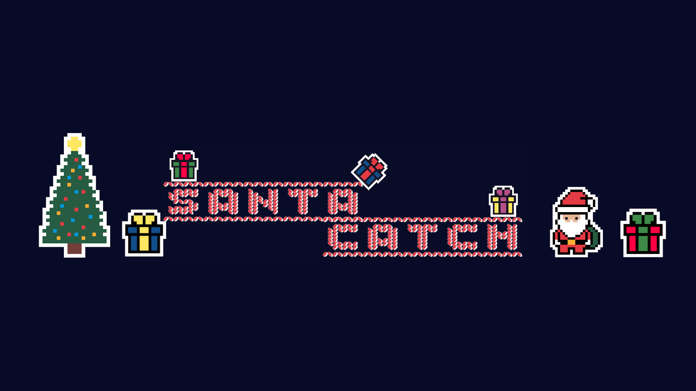
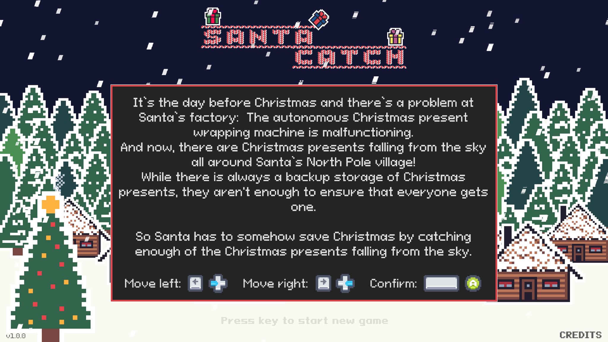
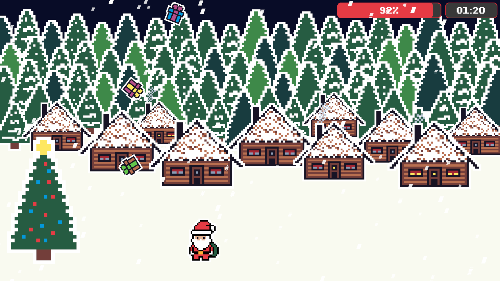
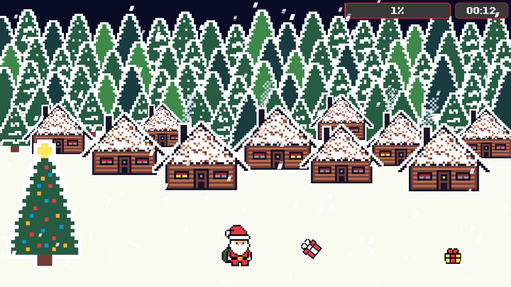

# 🎅🎁 Santa Catch 🎅🎁
**🎄 My 2nd game while learning GameDev in Godot Engine 4 🎄**

## Content
- [About](#about)
- [How to play the game](#how-to-play-the-game)
- [Disclaimer](#disclaimer)
- [Technical Restrictions](#technical-restrictions)
- [Resources used](#resources-used)
- [Lessons Learned](#lessons-learned)
- [Backlog for Version 2](#backlog-for-version-2)
- [Third Party Licenses](#third-party-licenses)

## About

It’s the day before Christmas and there’s a problem at Santa’s factory:
The autonomous Christmas present wrapping machine is malfunctioning.

And now, there are Christmas presents falling from the sky all around Santa’s North Pole village!
While there is always a backup storage of Christmas presents, they aren't enough to ensure that everyone gets one.

So Santa has to somehow save Christmas by catching enough of the Christmas presents falling from the sky…

Be sure to watch my [demo video of Santa Catch on YouTube](https://www.youtube.com/watch?v=iOPmQ9qKjzU) :movie_camera:
to see the game in action. :sunglasses:

Here are some screenshots of the game:

## How to play the game

I uploaded an HTML5-Export of the game to
[itch.io](https://danielthefox.itch.io/santa-catch),
so that you can
[play Santa Catch in your web browser](https://danielthefox.itch.io/santa-catch). :joystick::globe_with_meridians:

In addition, I uploaded
[binary exports of the game for Mac OS, Windows and Linux](https://danielthefox.itch.io/santa-catch) :joystick::computer:
to itch.io as well.

To move left & right you can use the arrow keys on your keyboard (or A, D).
In addition, the game supports game controllers! 🤩
I successfully played the game with a XBox Wireless controller and a PlayStation 5 Dualshock wireless controller
in the Mac OS Universal binary, as well as in Safari on Mac OS.

## Disclaimer

Use this software at your own risk. No warranty and no support.

If you run into difficulties or have improvement suggestions, feel free to
[open an issue ticket on GitHub](https://github.com/Daniel-The-Fox/santa-catch/issues)
and I might have a look at it, if I find the time. 😉

## Technical Restrictions

I encountered the following technical restrictions while testing the game in the following setups:

**TODO: Update this for Santa Catch!!!**

| Export Type      | OS  | Web Browser | Playable?    | Restrictions encountered |
| ---------------- | --- | ----------- | :----------: | ------------------------ |
| :globe_with_meridians: HTML5 on itch.io | :apple: MacOS 14.2.1 | Safari 17.2.1 | ✓ | Apple M2 silicon |
| :globe_with_meridians: HTML5 on itch.io | :apple: MacOS 14.2.1 | Chrome 120.0.6099.216 | ✓ | arm64 |
| :globe_with_meridians: HTML5 on itch.io | :apple: MacOS 14.2.1 | Firefox 121.0.1 | ❌ | Game freezes while loading! |
| :globe_with_meridians: HTML5 on itch.io | :penguin: Ubuntu 22.04.3 | Firefox 121.0.1 | ✓ | Note: Tested inside a VMWare Fusion 13.5.0 VM |
| :globe_with_meridians: HTML5 on itch.io | :window: Windows | Internet Explorer | ❓ | Not tested* |
| :globe_with_meridians: HTML5 on itch.io | :window: Windows | Firefox | ❓ | Not tested* |
| :globe_with_meridians: HTML5 on itch.io | :window: Windows | Chrome | ❓ | Not tested* |
| :penguin: Linux x86_64 binary | Ubuntu 22.04.3 LTS | - | ✓ | Note: Tested inside a VMWare Fusion 13.5.0 VM |
| :penguin: Linux arm64 binary | Ubuntu 22.04.3 LTS | - | ✓ | Note: Tested via [Box64](https://box86.org) inside a VMWare Fusion 13.5.0 VM |
| :apple: MacOS binary | MacOS 14.2.1 | - | ✓ | Apple M2 silicon |
| :window: Windows binary | Windows x86_64 | - | ❓ | Not tested* |

\* I don't have a Windows (virtual) machine I can use to test my games anymore.
If you run the game on Windows as binary or in a web browser, please let me know
by [opening an issue ticket on GitHub](https://github.com/Daniel-The-Fox/santa-catch/issues)! 👋

While the above overview is no 100% guarantee that the game functions on your setup,
it can give you a good indication.

Note: The SharedArrayBuffer support feature is activated on the game page on itch.io.

## Resources used

* [The Godot Engine](https://godotengine.org), Version 4.2.1 :robot:
* The pixel art for this game is inspired by the great pixel art tutorial videos by
[Pxel_art_ids](https://www.youtube.com/@Pxel_art_ids) :heart:
* I created all the pixel art for this game, including animations, in the perfectly-suited pixel art drawing App called
[Pixaki](https://pixaki.com)
* For image manipulation on my desktop computer, I used the #1 Open Source image editing app
[Gimp](https://www.gimp.org)
* All [sound effects and background music](https://freesound.org) are from freesound.org
* The color shader used to dynamically change the color combination of the Christmas presents
is based on the very clean code from AThousandShips at
https://github.com/godotengine/godot-proposals/issues/6870#issuecomment-1873460946
and the very useful
[tutorial video by Yep](https://www.youtube.com/watch?v=4qzi5fEJs4s)
* The snow shader is created by Steampunkdemon and can be found at:
https://steampunkdemon.itch.io/rain-and-snow-shader-with-parallax-effect-for-godot
or
https://godotshaders.com/shader/rain-and-snow-with-parallax-scrolling-effect/
* The random player name generator is inspired by the [random container names in Docker](https://github.com/moby/moby/blob/master/pkg/namesgenerator/names-generator.go)
* The online highscore is powered by the great [SilentWolf backend services for Godot Engine](https://www.silentwolf.com)
* The fade effect when switching scenes is based on the very useful and entertaining
[tutorial video by Game Endeavor](https://www.youtube.com/watch?v=_4_DVbZwmYc)
* Main headlines are using the font
[Jolly Sweater by GGBotNet](https://ggbot.itch.io/jolly-sweater-font)
* Normal text is displayed using the font
[Pixeloid by GGBotNet](https://ggbot.itch.io/pixeloid-font)
* The game control icons are from
[kenney.nl](https://kenney.nl)
* The ultra-realistic voice-overs for the intro & outro scenes
are AI-generated text-to-speech from
[Elevenlabs' free AI Voice online service](https://elevenlabs.io/?from=partnerpalmer5730) (Affiliate link)
* The audio icons shown to web browser players in the title screen are from Kicked-in-Teeth at:
https://kicked-in-teeth.itch.io/button-ui

## Lessons Learned

Here are the lessons I learned while developing this game in Godot Engine 4.
They serve as a sort of developer's diary for myself in the first place, but I'd be happy if they're helpful for some of you as well! 😁

* If you don’t receive any mouse click signals, it’s highly probable that you added at some point of time some sort of control node (i.e. a ColorRect!) which is blocking („eating“) mouse click signals. For details, see https://docs.godotengine.org/en/stable/classes/class_control.html#class-control-property-mouse-filter. This lost me hours of debugging the first time and minutes of debugging the second time it happened to me. The issue here is that some control node types have „mouse_filter“ set to „stop“ by default which will „eat“ all mouse signals and prevent any other nodes from receiving mouse events! 🙄🤦🏼‍♂️🫣
* Another reason could be your layer order
* Define a default theme from the very beginning, even if you only define a font size and font color in it. With time, there will be more and more things you’ll add and be grateful when you already have it and don’t have to change theme override settings you made during prototyping phase! 😁
* Shaders are doable, when using pre-made easy shaders to begin with. The Godot Docs on shaders are ok, but weren’t sufficient for my understanding. Here’s a great overview on Godot shaders that helped me a lot: https://www.nightquestgames.com/the-magic-behind-shaders-in-godot-4/
* Shaders can be quite handy to dynamically generate color variations of the same sprite, which saves time to create game assets and is much more flexible. The chosen shader then also applies to any animation of the same sprite! 🤩
* Use a central event bus to define which signals your game can use (autoload)
* Use a singleton for global game-wide variables (autoload)
* Try to always connect to signals and do it in the _ready() function of the node that will be waiting for a certain signal later on. Just waiting for the signal without previously connecting to it, can lead to serious race conditions which can cause you hours of debugging time wasted! Trust me, I’ve been there several times… 😢😂🤦🏼‍♂️
* Plan, plan, plan well in advance. Even if you miss any deadlines set. At least you have an overview of all the tasks of your game project and can keep track of what’s done and what’s still to come. While doing so, you’ll eventually come up with tasks you didn’t even think about in the first place and might have slipped through otherwise.
* PackedScenes and export variables are your friends! 🙃
* Implement a debug mode (per scene, if needed) for quick testing and make it controllable via export variables. This speeds up testing! Plan for this from the beginning!
* Timers are very handy for all sorts of game flow controls.
* Think of scenes like objects you can instantiate in object-oriented programming. I literally have a scene „Tree“ and another scene „Forest“ which has a bunch of instantiated child nodes of type „Tree“ in which I placed the trees how I wanted. This was a lot faster and flexible than doing this in an image editor! 😉
* Use Godot for rotating or moving your sprites in an animation where possible. You’ll have much more control!
* Start with a simple prototype with the Godot icon and implement the basic (movement) concept of your game idea, then start slowly to add graphic assets. Only after that, start adding sound effects and music.
* Randomizing the choice of your graphic assets (color variations), sound effects (several options per sfx) and music make your game more interesting, is fun and gives you a motivational boost during development. 😁
* Use a game version. You can do this i.e. by defining a custom field in the project settings you can then access in GDScript later on. Incorporate the game version in the binaries you upload to itch.io, etc.
* Adding game controller support for your game in Godot Engine is super easy! Did you know you can easily connect your XBox or Playstation wireless controller to your computer via Bluetooth? 😎
* Colors in Godot are vectors of floating point numbers, also in Godot shaders!
* Don’t compare floats via „==„! For details, see
    * https://docs.godotengine.org/en/stable/tutorials/shaders/shader_reference/shading_language.html#flow-control
    * https://github.com/godotengine/godot-proposals/issues/6870#issuecomment-1874223848
* Anything I probably forgot to mention! 🤣

## Backlog for Version 2

Time is limited on any project. Otherwise, project would probably never finish as there's always something to improve and fine-tune.
Therefore, I consider for every idea I have before, during and even after development how it contributes to the overall goal
of publishing the game in development and bringing joy. Naturally, this means that there's always a backlog of good ideas waiting to get implemented
in a future update of the game. 😜🤷‍♂️

* Background image of falling presents (tiled) on itch.io page
* Optimize Highscore behavior for double entries:
    * When checking for a new Highscore, don’t simply compare scores, but also compare player names in order to avoid double Highscore entries for the same user. Instead, update their existing Highscore entry.
    * Hint: The online Highscore service SilentWolf does this automatically after saving the Highscore, but the user will see a double entry first. Only after restarting the game and reloading the online Highscore will he/she see the squashed online Highscore. Locally, a user could currently hold all 10 Highscore entries!
* Move handle_input to GameStats Singleton
* Santa walk animation
    * Bonus: Uncomment player tween on game ended
* Initially generate all color combinations for Christmas presents and then store them for re-usage (still image & crash animations) for spawning presents, instead of re-generating presents via shader over and over again.
    * Should improve game performance and take load away from CPU/GPU during game play…? 🤔
    * Generate pre-defined color combinations and some (5-20) random additional color combinations to store and use them randomly during game play
    * Can Godot save the resulting objects as images to disk? Can Godot be used as an asset generation pipeline? 😂🤷🏼‍♂️
* Real random rotation speed & rotation direction for presents by scripting a randomized rotation animation (via Tween?)
* House animations more random so that lights don’t all turn on at same time
* Use real 2D lights from Godot for houses and Christmas tree?
    * Bonus: Have a night mode with only street lamps as light source
* Santa catch animation
* Bag for Santa to collect presents in
* Twinkling stars on night sky
* Design decision reg. Intro screen (story) vs. title screen (main menu)
    * Most games show main menu first, then intro screen (story) after starting new game
* Main menu
    * (Resume)
    * New Game
    * Credits
    * Exit
* Make Game pausible via ESC key
    * Which button on game controller?
* Settings Menu
    * Volumes sfx vs. music
    * Choose background music
    * Choose Santa sprite (color)
    * Option to randomize Santa sprite
* Create foot steps in the snow when Santa walks
    * Classic task for a Shader?
    * Steps disappear after some time again, as is when it’s snowing

## Third Party Licenses

See also [https://godotengine.org/license/](https://godotengine.org/license/)

------------------------------------------------

This game uses Godot Engine, available under the following license:

Copyright (c) 2014-present Godot Engine contributors. Copyright (c) 2007-2014 Juan Linietsky, Ariel Manzur.

Permission is hereby granted, free of charge, to any person obtaining a copy of this software and associated documentation files (the \\\"Software\\\"), to deal in the Software without restriction, including without limitation the rights to use, copy, modify, merge, publish, distribute, sublicense, and/or sell copies of the Software, and to permit persons to whom the Software is furnished to do so, subject to the following conditions:

The above copyright notice and this permission notice shall be included in all copies or substantial portions of the Software.

THE SOFTWARE IS PROVIDED \\\"AS IS\\\", WITHOUT WARRANTY OF ANY KIND, EXPRESS OR IMPLIED, INCLUDING BUT NOT LIMITED TO THE WARRANTIES OF MERCHANTABILITY, FITNESS FOR A PARTICULAR PURPOSE AND NONINFRINGEMENT. IN NO EVENT SHALL THE AUTHORS OR COPYRIGHT HOLDERS BE LIABLE FOR ANY CLAIM, DAMAGES OR OTHER LIABILITY, WHETHER IN AN ACTION OF CONTRACT, TORT OR OTHERWISE, ARISING FROM, OUT OF OR IN CONNECTION WITH THE SOFTWARE OR THE USE OR OTHER DEALINGS IN THE SOFTWARE.

------------------------------------------------

Godot uses FreeType to render fonts. Its license requires attribution, so the following text must be included together with the Godot license:

Portions of this software are copyright © 1996-2023 The FreeType Project (www.freetype.org). All rights reserved.

------------------------------------------------

Godot includes the ENet library to handle high-level multiplayer. ENet has similar licensing terms as Godot:

Copyright (c) 2002-2020 Lee Salzman

Permission is hereby granted, free of charge, to any person obtaining a copy of this software and associated documentation files (the \\\"Software\\\"), to deal in the Software without restriction, including without limitation the rights to use, copy, modify, merge, publish, distribute, sublicense, and/or sell copies of the Software, and to permit persons to whom the Software is furnished to do so, subject to the following conditions:

The above copyright notice and this permission notice shall be included in all copies or substantial portions of the Software.

THE SOFTWARE IS PROVIDED \\\"AS IS\\\", WITHOUT WARRANTY OF ANY KIND, EXPRESS OR IMPLIED, INCLUDING BUT NOT LIMITED TO THE WARRANTIES OF MERCHANTABILITY, FITNESS FOR A PARTICULAR PURPOSE AND NONINFRINGEMENT. IN NO EVENT SHALL THE AUTHORS OR COPYRIGHT HOLDERS BE LIABLE FOR ANY CLAIM, DAMAGES OR OTHER LIABILITY, WHETHER IN AN ACTION OF CONTRACT, TORT OR OTHERWISE, ARISING FROM, OUT OF OR IN CONNECTION WITH THE SOFTWARE OR THE USE OR OTHER DEALINGS IN THE SOFTWARE.

------------------------------------------------

If the project is exported with Godot 3.1 or later, it includes mbed TLS. The Apache license needs to be complied to by including the following text:

Copyright The Mbed TLS Contributors

Licensed under the Apache License, Version 2.0 (the \\\"License\\\"); you may not use this file except in compliance with the License. You may obtain a copy of the License at

http://www.apache.org/licenses/LICENSE-2.0

Unless required by applicable law or agreed to in writing, software distributed under the License is distributed on an \\\"AS IS\\\" BASIS, WITHOUT WARRANTIES OR CONDITIONS OF ANY KIND, either express or implied. See the License for the specific language governing permissions and limitations under the License.

------------------------------------------------

The Jolly Sweater and Pixeloid Font Software are licensed under the SIL Open Font License, Version 1.1.
This license is copied below, and is also available with a FAQ at:
https://openfontlicense.org

-----------------------------------------------------------
SIL OPEN FONT LICENSE Version 1.1 - 26 February 2007
-----------------------------------------------------------

PREAMBLE
The goals of the Open Font License (OFL) are to stimulate worldwide
development of collaborative font projects, to support the font creation
efforts of academic and linguistic communities, and to provide a free and
open framework in which fonts may be shared and improved in partnership
with others.

The OFL allows the licensed fonts to be used, studied, modified and
redistributed freely as long as they are not sold by themselves. The
fonts, including any derivative works, can be bundled, embedded,
redistributed and/or sold with any software provided that any reserved
names are not used by derivative works. The fonts and derivatives,
however, cannot be released under any other type of license. The
requirement for fonts to remain under this license does not apply
to any document created using the fonts or their derivatives.

DEFINITIONS
\"Font Software\" refers to the set of files released by the Copyright
Holder(s) under this license and clearly marked as such. This may
include source files, build scripts and documentation.

\"Reserved Font Name\" refers to any names specified as such after the
copyright statement(s).

\"Original Version\" refers to the collection of Font Software components as
distributed by the Copyright Holder(s).

\"Modified Version\" refers to any derivative made by adding to, deleting,
or substituting -- in part or in whole -- any of the components of the
Original Version, by changing formats or by porting the Font Software to a
new environment.

\"Author\" refers to any designer, engineer, programmer, technical
writer or other person who contributed to the Font Software.

PERMISSION & CONDITIONS
Permission is hereby granted, free of charge, to any person obtaining
a copy of the Font Software, to use, study, copy, merge, embed, modify,
redistribute, and sell modified and unmodified copies of the Font
Software, subject to the following conditions:

1) Neither the Font Software nor any of its individual components,
in Original or Modified Versions, may be sold by itself.

2) Original or Modified Versions of the Font Software may be bundled,
redistributed and/or sold with any software, provided that each copy
contains the above copyright notice and this license. These can be
included either as stand-alone text files, human-readable headers or
in the appropriate machine-readable metadata fields within text or
binary files as long as those fields can be easily viewed by the user.

3) No Modified Version of the Font Software may use the Reserved Font
Name(s) unless explicit written permission is granted by the corresponding
Copyright Holder. This restriction only applies to the primary font name as
presented to the users.

4) The name(s) of the Copyright Holder(s) or the Author(s) of the Font
Software shall not be used to promote, endorse or advertise any
Modified Version, except to acknowledge the contribution(s) of the
Copyright Holder(s) and the Author(s) or with their explicit written
permission.

5) The Font Software, modified or unmodified, in part or in whole,
must be distributed entirely under this license, and must not be
distributed under any other license. The requirement for fonts to
remain under this license does not apply to any document created
using the Font Software.

TERMINATION
This license becomes null and void if any of the above conditions are
not met.

DISCLAIMER
THE FONT SOFTWARE IS PROVIDED \"AS IS\", WITHOUT WARRANTY OF ANY KIND,
EXPRESS OR IMPLIED, INCLUDING BUT NOT LIMITED TO ANY WARRANTIES OF
MERCHANTABILITY, FITNESS FOR A PARTICULAR PURPOSE AND NONINFRINGEMENT
OF COPYRIGHT, PATENT, TRADEMARK, OR OTHER RIGHT. IN NO EVENT SHALL THE
COPYRIGHT HOLDER BE LIABLE FOR ANY CLAIM, DAMAGES OR OTHER LIABILITY,
INCLUDING ANY GENERAL, SPECIAL, INDIRECT, INCIDENTAL, OR CONSEQUENTIAL
DAMAGES, WHETHER IN AN ACTION OF CONTRACT, TORT OR OTHERWISE, ARISING
FROM, OUT OF THE USE OR INABILITY TO USE THE FONT SOFTWARE OR FROM
OTHER DEALINGS IN THE FONT SOFTWARE.

------------------------------------------------

